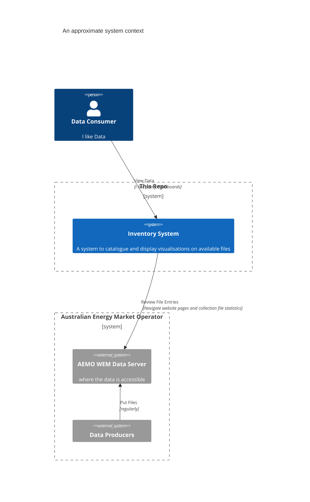
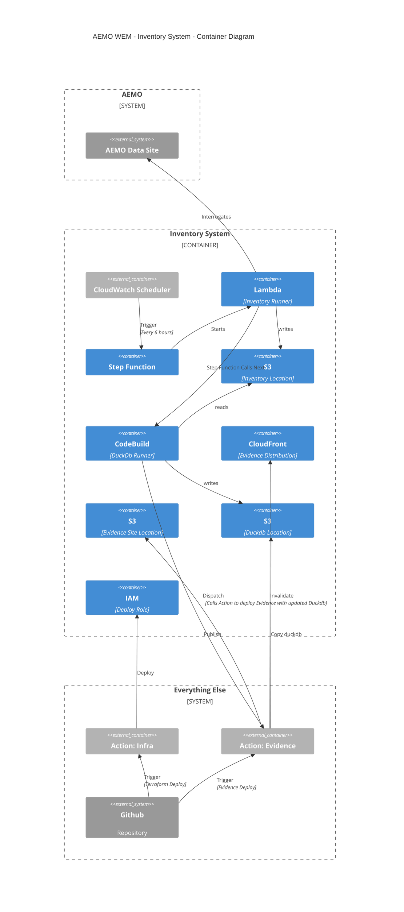

# AEMO WEM Inventory - supporting infrastructure

A Terraform project to deploy supporting components to an AWS account

It does not install but relies on

-   a deployment role with permission to deploy the stuff
-   a permission boundary that limits the scope of the roles we can create in this project

## C4 - System Context

This system (AEMO WEM inventory) interrogates another system (AEMO WEM Data Server - managed by AEMO) and generates a visualisation based on the data that is gathered.

### C4 - Container Diagram

The system in this repository:

-   periodically crawls the AEMO data server, following directory links, gathering statistics about files and directories, to form an _inventory_
-   writes _inventory_ results to S3
-   produces a duckdb database populated with the _inventory_ data from S3
-   builds a static website with [Evidence.dev](https://evidence.dev) and deploys it with CloudFront CDN backed by S3 Origin

